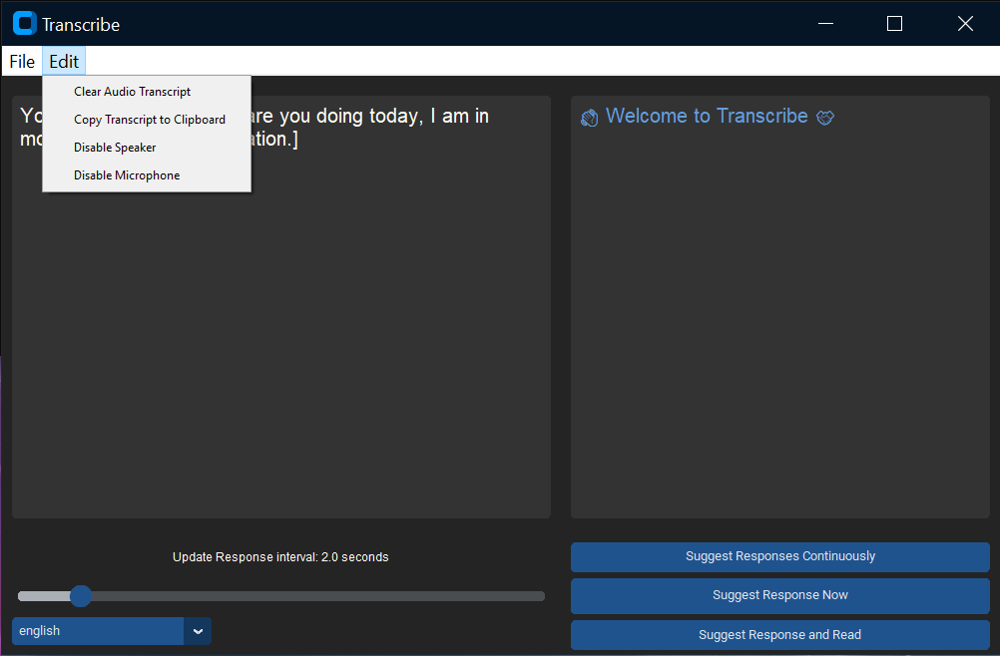
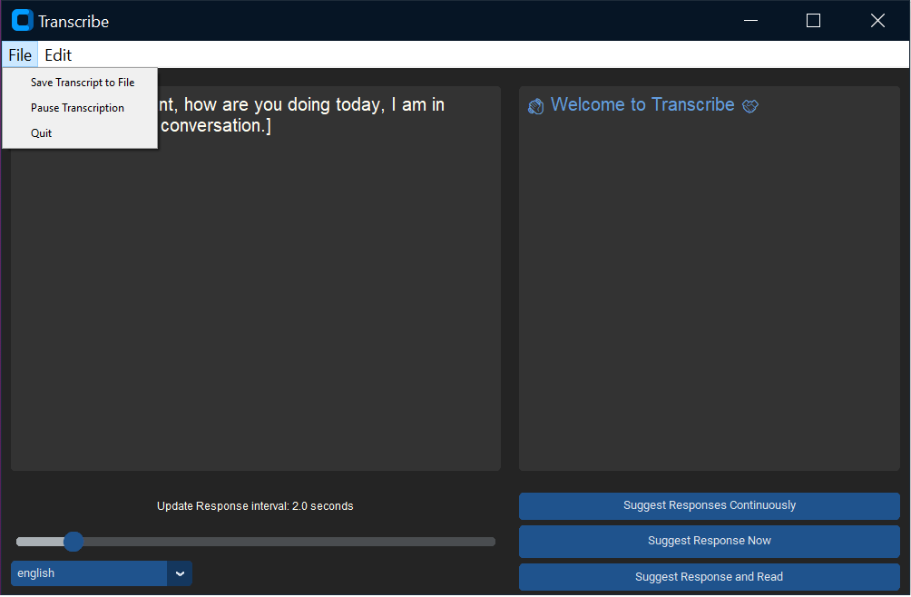

# Audio Customization #

### Enable Disable Mic, Speaker Transcription
Transcribe allows users to selectively enable / disable microphone input or speaker output for Transcription.

The easiest way to do this is using the User Interface. Use the Menu Items for
- Disable Speaker
- Disable Microphone



An alternate way to do this is using command line arguments at the time of starting Transcribe

```
  -dm, --disable_mic    Disable transcription from Microphone
  -ds, --disable_speaker
                        Disable transcription from Speaker
```

E.g.
The following command line will start Transcribe with Transcription from Microphone disabled.

```
  python main.py -dm
```

### Pause Transcription
Transcribe allows users to pause transcription completely. This can be done using the User Interface




### List devices

Computers with many microphone, speakers can have a potential issue of selecting the correct speakers, microphone.

Transcribe allows to list all audio devices.
The device index can be used to select a specific speaker, microphone for transcription using the `-mi`, `-si` options on command line

Listing of all devices can be obtained as below
```
python main.py -l

List all audio drivers and devices on this machine

| ~ Audio Drivers on this machine ~ |

 ^ # INDEX # DRIVER TYPE #  DEVICE COUNT # NAME
-----------------------------------------------
 »   [0]   |      2      |       9       |  MME
 »   [1]   |      1      |       9       |  Windows DirectSound
 »   [2]   |      13     |       10      |  Windows WASAPI

| ~ Audio Devices on this machine ~ |

 ^ # INDEX # HOST API INDEX # LOOPBACK # NAME
---------------------------------------------
 »   [0]          0            False     Microsoft Sound Mapper - Input
 »   [1]          0            False     Microphone (Voicemod Virtual Au)
 »   [2]          0            False     Microphone (Logitech BRIO)
 »   [3]          0            False     Microphone (High Definition Aud)
 »   [4]          0            False     Microsoft Sound Mapper - Output
 »   [5]          0            False     DELL U3219Q (NVIDIA High Defini)
 »   [6]          0            False     Line (Voicemod Virtual Audio De)
 »   [7]          1            False     Primary Sound Capture Driver
 »   [8]          1            False     Microphone (Voicemod Virtual Audio Device (WDM))
 »   [9]          1            False     Microphone (Logitech BRIO)
 »   [10]         1            False     Microphone (High Definition Audio Device)
 »   [11]         1            False     Primary Sound Driver
 »   [12]         1            False     DELL U3219Q (NVIDIA High Definition Audio)
 »   [13]         1            False     Line (Voicemod Virtual Audio Device (WDM))
 »   [14]         2            False     DELL U3219Q (NVIDIA High Definition Audio)
 »   [15]         2            False     Line (Voicemod Virtual Audio Device (WDM))
 »   [16]         2            False     Microphone (Logitech BRIO)
 »   [17]         2            False     Microphone (High Definition Audio Device)
 »   [18]         2            False     Microphone (Voicemod Virtual Audio Device (WDM))
 »   [19]         2             True     DELL U3219Q (NVIDIA High Definition Audio) [Loopback]
 »   [20]         2             True     Headset Earphone (Corsair HS60 PRO Surround USB Sound Adapter) [Loopback]
 »   [21]         2             True     Line (Voicemod Virtual Audio Device (WDM)) [Loopback]
```

A specific audio device can be selected using the below two options

```
  -mi MIC_DEVICE_INDEX, --mic_device_index MIC_DEVICE_INDEX
                        Device index of the microphone for capturing sound.
                        Device index can be obtained using the -l option.
  -si SPEAKER_DEVICE_INDEX, --speaker_device_index SPEAKER_DEVICE_INDEX
                        Device index of the speaker for capturing sound.

E.g.

python main.py -mi 3 -si 16

```
