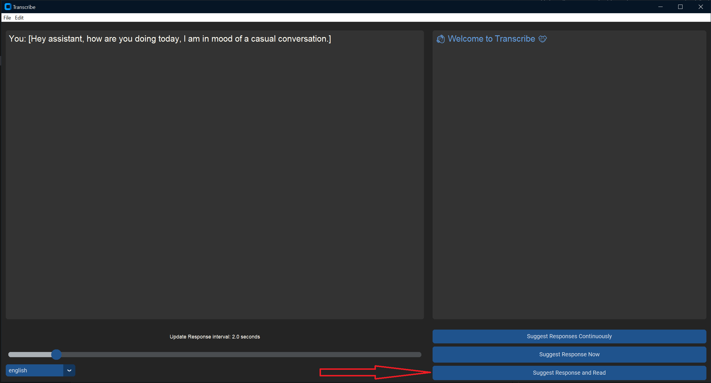

## Speech Mode

Default option in Transcribe is to provide responses as text in the response window.

Optionally users can disable continuous responses and get Audio responses in addition to text responses using the Suggest Response and Read button as displayed in the image below.

