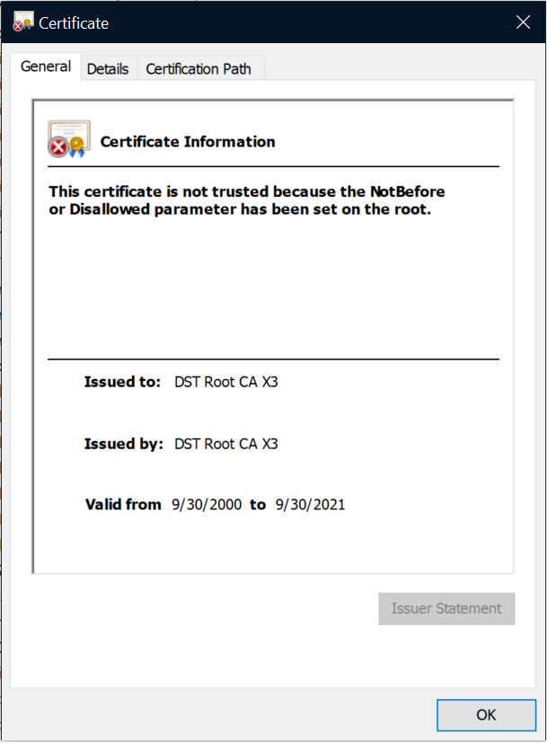

## Usage ##

Sample program for Deeepgram Speech to Text API

Requirements
- Python 3.11 or higher
- Create a Deepgram API key at https://console.deepgram.com/signup?jump=keys


```python
pip install deepgram-sdk

# Change these 2 lines in stt.py
DEEPGRAM_API_KEY = '<API_KEY>'
# Path to a .wav file for transcription
PATH_TO_FILE = '<PATH_TO_WAV_FILE>'

# Execute stt.py
python stt.py
```

## Troubleshooting (Windows Only) ##

### SSL Certificate Validation Error (Windows only) ###
On windows SSL Certificate validation error is observed on some systems.

```
[SSL: CERTIFICATE_VERIFY_FAILED] certificate verify failed: certificate has expired (_ssl.c:1002)
```

### Remediation ###
Remove the certificate `DST Root CA X3` from these certificate stores on windows

```
    Current User -> Intermediate Certification Authorities -> Certificates
	Local Computer -> Trusted Root Certificate Authorities -> Certificates
```
It is possible this certificate exists in some other stores as well.

### Are you impacted by this problem ###

Execute the file `test_cert_issue.py` in this directory.
If the machine is potentially impacted by this issue, details of the certificate will be shown on the screen.

If the machine is not impacted by this issue, below output will be displayed.
```
 C:\deep>python test.py
Determining if you are potentially impacted by the expired DST certificate.
The problematic certificate is not in the certificate stores.
```

## Details ##
Some windows machines display SSL error when using the Deepgram API on windows.

The sample code below produces SSL errors 

```python
import json
from deepgram import Deepgram

# Create Deepgram API key at https://console.deepgram.com/signup?jump=keys
DEEPGRAM_API_KEY = '<API_KEY>'
# Path to a .wav file for transcription
PATH_TO_FILE = '<PATH_TO_WAV_FILE>'

def main():
    # Initializes the Deepgram SDK
    deepgram = Deepgram(DEEPGRAM_API_KEY)
    # Open the audio file
    with open(PATH_TO_FILE, 'rb') as audio:
        source = {'buffer': audio, 'mimetype': 'audio/wav'}
        response = deepgram.transcription.sync_prerecorded(source, {'punctuate': True})
        print(json.dumps(response, indent=4))

main()
```

SSL Error Produced by above code
```
[SSL: CERTIFICATE_VERIFY_FAILED] certificate verify failed: certificate has expired (_ssl.c:1002)
Traceback (most recent call last):
  File "C:\Python311\Lib\urllib\request.py", line 1364, in do_open
    h.request(req.get_method(), req.selector, req.data, headers,
  File "C:\Python311\Lib\http\client.py", line 1309, in request
    self._send_request(method, url, body, headers, encode_chunked)
  File "C:\Python311\Lib\http\client.py", line 1356, in _send_request
    self.endheaders(body, encode_chunked=encode_chunked)
  File "C:\Python311\Lib\http\client.py", line 1302, in endheaders
    self._send_output(message_body, encode_chunked=encode_chunked)
  File "C:\Python311\Lib\http\client.py", line 1052, in _send_output
    self.send(msg)
  File "C:\Python311\Lib\http\client.py", line 981, in send
    self.connect()
  File "C:\Python311\Lib\http\client.py", line 1482, in connect
    self.sock = self._context.wrap_socket(self.sock,
                ^^^^^^^^^^^^^^^^^^^^^^^^^^^^^^^^^^^^
  File "C:\Python311\Lib\ssl.py", line 517, in wrap_socket
    return self.sslsocket_class._create(
           ^^^^^^^^^^^^^^^^^^^^^^^^^^^^^
  File "C:\Python311\Lib\ssl.py", line 1075, in _create
    self.do_handshake()
  File "C:\Python311\Lib\ssl.py", line 1346, in do_handshake
    self._sslobj.do_handshake()
ssl.SSLCertVerificationError: [SSL: CERTIFICATE_VERIFY_FAILED] certificate verify failed: certificate has expired (_ssl.c:1002)

During handling of the above exception, another exception occurred:

Traceback (most recent call last):
  File "C:\j\deep\dg.py", line 25, in <module>
    main()
  File "C:\j\deep\dg.py", line 20, in main
    response = deepgram.transcription.sync_prerecorded(source, {'punctuate': True})
               ^^^^^^^^^^^^^^^^^^^^^^^^^^^^^^^^^^^^^^^^^^^^^^^^^^^^^^^^^^^^^^^^^^^^
  File "C:\j\deep\venv\Lib\site-packages\deepgram\transcription.py", line 370, in sync_prerecorded
    return SyncPrerecordedTranscription(
           ^^^^^^^^^^^^^^^^^^^^^^^^^^^^^
  File "C:\j\deep\venv\Lib\site-packages\deepgram\transcription.py", line 117, in __call__
    return _sync_request(
           ^^^^^^^^^^^^^^
  File "C:\j\deep\venv\Lib\site-packages\deepgram\_utils.py", line 169, in _sync_request
    raise exc # stream is now invalid as payload
    ^^^^^^^^^
  File "C:\j\deep\venv\Lib\site-packages\deepgram\_utils.py", line 166, in _sync_request
    return attempt()
           ^^^^^^^^^
  File "C:\j\deep\venv\Lib\site-packages\deepgram\_utils.py", line 150, in attempt
    with urllib.request.urlopen(req, timeout=timeout) as resp:
         ^^^^^^^^^^^^^^^^^^^^^^^^^^^^^^^^^^^^^^^^^^^^
  File "C:\Python311\Lib\urllib\request.py", line 216, in urlopen
    return opener.open(url, data, timeout)
           ^^^^^^^^^^^^^^^^^^^^^^^^^^^^^^^
  File "C:\Python311\Lib\urllib\request.py", line 526, in open
    response = self._open(req, data)
               ^^^^^^^^^^^^^^^^^^^^^
  File "C:\Python311\Lib\urllib\request.py", line 549, in _open
    result = self._call_chain(self.handle_open, protocol, protocol +
             ^^^^^^^^^^^^^^^^^^^^^^^^^^^^^^^^^^^^^^^^^^^^^^^^^^^^^^^
  File "C:\Python311\Lib\urllib\request.py", line 499, in _call_chain
    result = func(*args)
             ^^^^^^^^^^^
  File "C:\Python311\Lib\urllib\request.py", line 1411, in https_open
    return self.do_open(http.client.HTTPSConnection, req,
           ^^^^^^^^^^^^^^^^^^^^^^^^^^^^^^^^^^^^^^^^^^^^^^
  File "C:\Python311\Lib\urllib\request.py", line 1370, in do_open
    raise URLError(err)
urllib.error.URLError: <urlopen error [SSL: CERTIFICATE_VERIFY_FAILED] certificate verify failed: certificate has expired (_ssl.c:1002)>
```
The primary issue is related to the expiration of DST Root CA X3. See the details of this issue at https://letsencrypt.org/docs/dst-root-ca-x3-expiration-september-2021/ . 

Deepgram API URL which caused the error in this case - https://api.deepgram.com/v1/listen?punctuate=true . 

The remediation is to remove the `DST Root CA X3` certificate from all certificate stores where it exists.



There are certain solutions on the web related to certifi, certifi-win-32, pip-system-certs. I tried those solutions but they did not help in this case.
